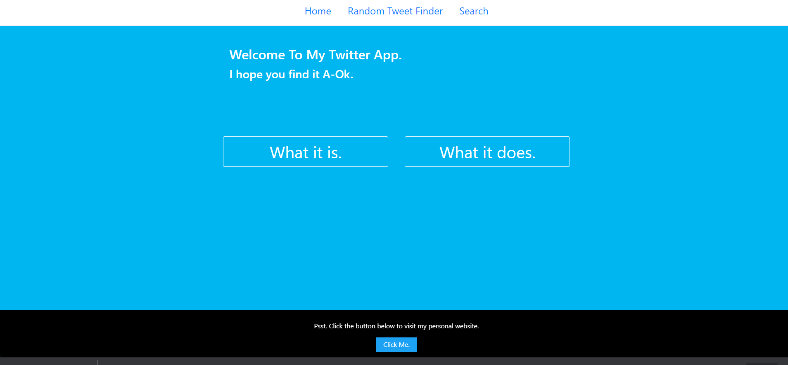

# Twitter Showcase App
 
 ### A full stack web app built with Node Js and React that uses authentication to call data from the Twitter API.
 
#### See it [here](https://twitteris-appicus.herokuapp.com/)
 
 
 
## Summary
This was one of my first full stack apps working with React and NodeJS. It was a lot of fun to figure out and increased my skill as a programmer considerably. I learned a lot about the value of separation of concerns, working with Node as a web server, authenticating with a token and calling data from a 3rd party and rendering it in the UI.

## Installation
1. Clone repository.
2. Create a developer account at [developer.twitter.com](https://developer.twitter.com/en) 
3. Create new app and follow directions to generate API KEY and SECRET KEY.
4. Run npm install from both in top level directory and from within the client folder.
5. run npm install dotenv
6. Create folder called .env in top level of directory
7. Inside .env add the lines API_KEY=yourApiKey and API_SECRET_KEY=yourSecretKey (replace text after = with the credentials you receive from developer.twitter.com)
8. from within top level directory of app, run npm start. The app should open at http://localhost:3000/

## Author
Trevor Mearns - Full Stack Software Developer [LinkedIn](https://www.linkedin.com/in/trevor-mearns-8a042a56/) | [Personal Website] currently under reconstruction.

